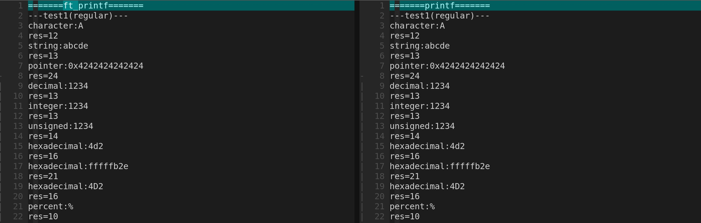

# 42_printf
*Because ft_putnbr() and ft_putstr() aren’t enough...*  

  

## What is this ?
This project is implementation of *printf* in C.  

## How to use ?
1. Please clone and compile this repository as follows.   
```
    git clone https://github.com/tmuramat081/42_printf.git
    cd 42_printf
    make
```
2. To use the library, please link *libftprintf.a* at compile.  
```
gcc main.c -L. -lftprintf -o main.exe
```
3. Don't forget to include this header in your code.  
```
#include "ft_printf.h"
```
## Reference

## Author
Taisei Muramatsu (tmuramat)  
